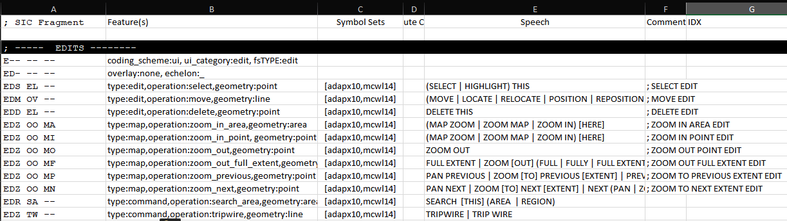

# Custom commands sample

This sample adds custom command handling to the  [Roles](../roles) sample.

For Prerequisites, Script references and Configuration, see the [gmaps sample README](../gmaps/README.md).

STP supports the definition of custom natural language commands, extending its baseline capabilities to include 
domain or application specific needs.
Custom commands define the language expected to be used, as well as the corresponding gesture - a point, a line or an area 
that provide the geo-location of the symbol.

While STP performs interpretation and ranking of the natural language, looking to identify the most likely intent of a user, the implementation of behavior associated with these actions rests with the client apps.
Achieving interface effects, or commanding other systems requires local capabilities that are not accessible to the STP Engine.

Commands may be defined for example to:

* Bring in extra imagery by letting users mark an area and speak "add imagery"
* Task an autonomous system by letting users select an object of interest by sketching a tick mark on top of the item and then speak "track and follow"
* Initiate some app action - for example save the project - by touching anywhere on the map (to activate speech recognition) and speaking "save project", or "save current project".

Capabilities illustrate by this sample include:

* Defining new commands via STP configuration
* Handling custom command events in client apps

## Defining new commands via STP configuration

Custom command definition is achieved by adding entries to STP's configuration tables.
In specific, these commands are defined in `<STP install folder>\MilTables\AuxiliaryTables\Edits.txt`.
`Edits` is a tab-separated file, and can be modified with a text editor, or by opening it with Excel.



* Column A - SIC Fragment - this is a (non-2525/APP6) symbol id that represents the custom item. 
Choose an id that starts with "ED", and then uniquely identify the element, following the 9-character "`--- -- --`"
pattern used in the other entries
* Column B - Features - defines the properties of the symbol:
    * **type:** defines the type of event
        * `edit` - symbol edit or state setting operation, reported via the `OnSymbolEdited` event (details below)
        * `map` - map operation, reported via the `OnMapOperation` event
        * `command` - custom command, reported via the `OnCommand` event
        NOTE: the first two types - `edit` and `map` are filtered so that only the client app that originated the operation gets to receive the resulting event - if a user selects an item with a sketch mark and speaks "select this", the resulting `OnSymbolEdited` event is raised just within that same client, which is responsible for enacting the operation, in this case, causing the item to be selected/highlighted.
        Similarly, sketching an area and speaking "zoom here" results in an `OnMapOperation` event being directed to just that originating app, which is responsible for causing the desired effect.
        In other words, unlike most other events in STP these are not propagated automatically to all clients that may be connected, since these represent local effects that are not meaningful for other users participating in a collaboration session.
        The `command` type, on the other hand, is understood to represent operations that should be propagated to all connected clients, which might include for example Connectors to third party consumer systems, such as an autonomous system being tasked via natural language.
    * **operation:** represents the name of the operation. This name is included in the notification events so that the client apps can determine what type of operation was identified by STP as representing the user's intent
    * **geometry:** - `point`, `line` or `area` sketched gesture that is expected to be provided by the user alongside the spoken utterance. 
    The coordinates os the sketched gesture are included in the notification events. 
    Commands that don't require a geo-location, but are just general spoken commands ("save project") should select `point` as the geometry, as in STP speech input is triggered by a gesture, so this point acts as a push-to-talk trigger.
* Column C - Symbol Sets - should be set to `[adapx10,mcwl14]` - these are configuration tags that can be used in advanced scenarios - contact Hyssos to learn more.
* Column D - leave empty (used in other tables, not relevant here)
* Column E - Speech - defines the language associated with the operation. The following operators can be used:
    * `[]` optional
    * `|` alternative
    * `()` grouping
    * Example: "SEARCH [THIS] (AREA | REGION) allows users to speak:
        SEARCH THIS AREA,
        SEARCH THIS REGION,
        SEARCH AREA,
        SEARCH REGION,
* Column F - Comments

NOTE: language that overlaps or is similar to that used to define standard military symbols should be avoided, as it might add ambiguity to the interpretation.

## Code walkthrough

See the [gmaps sample](../gmaps) for details on most of the code. Here just the changes introduced in this sample - custom command handling - are described.


### Handling command events

As seen in previous samples, it is important to subscribe to the handlers of interest before connecting to STP. This information is used by the SDK to build the corresponding subscription parameters that tell STP which events/messages to send to this client app.

This samples adds the following subscriptions:

* onSymbolEdited - `type` `edit` operation recognized
* onMapOperation - `type` `map` operation recognized
* onCommand - `type` `command` operation recognized

These events receive two parameters:

* The `operation` parameter identifies the `Edits` table property of the same name.

* The `location` parameter provides detailed information about the associated sketched gesture (table below).


| Property          | Description                                                                   |
| ---------------   | ----------------------------------------------------------------------------- |
| fsTYPE            | Location type: point,line, area |
| width             | Location width, if applicable |
| shape             | Gesture type: point, line or area |
| radius            | Radius of the area containing the symbol, if applicable (zero for point locations) |
| coords            | Array of { lat: latitude, lon: longitude } |
| centroid          | Coordinates of the location centroid { lat: latitude, lon: longitude } |
| candidatePoids    | Unique Ids of the symbols intersected by "coords". Used for editing operations that use sketches to select objects, for example "move this", "delete this" |

Of main interest for edit operations are the following:
    * shape: `point`, `line` or `area`
    * coords: array of coordinates
    * candidatePoids - for gestures that assume a selection of a target symbol, such as `delete`, this property contains the unique identifiers of the symbols overlapped by the gesture.

NOTE: `candidatePoids` is only available if the client app is properly collecting and sending this information as part of the `sendInk` method -  see the (quickstart)[../../quickstart/README.md) for a discussion. 
The simple mapping used in this collection of samples does _not_ support that.
As a consequence, symbol-targeted operations are not supported by the samples.

 **onSymbolEdited**

These operations can be generic interface commands, or refer to specific symbols on the map.
In the later case, `candidatePoids` provides the potential targets of the operation. 
The latter are impacted by the samples' limitation discussed above - the list of poids is always empty, even if the sketched gesture does overlap placed symbols.

```javascript
// A new edit operation has been identified
stpsdk.onSymbolEdited = (operation: string, location: StpType.Location) => {
    try {
        // Display some properties
        log("Symbol edit operation: " + operation + " gesture:" + location.shape, "Info");
    } catch (error) {
        log(error.message, "Warning");
    }
};
```


**onMapOperation**

Similar map operations may exist, for example to `zoom`, with different behavior depending on the gesture used. 
A fixed zoom around a point, into an area, or defined by the bounding box of a line might for example be offered.

```javascript
// A new edit operation has been identified
stpsdk.onMapOperation = (operation: string, location: StpType.Location) => {
    try {
        // Display some properties
        log("Map operation: " + operation + " gesture:" + location.shape, "Info");
    } catch (error) {
        log(error.message, "Warning");
    }
};
```

**onCommand**

The main difference between this class of events and the previous ones (`onSymbolEdited` and `onMapOperation`) is that these events are not restricted to just the client that issues the speech and sketch that results in the event. 
All connected clients are notified. Care must therefore be taken to avoid multiple similar clients from executing system-wide operations that might clash with each other.

```javascript
// A new edit operation has been identified
stpsdk.onCommand = (operation: string, location: StpType.Location) => {
    try {
        // Display some properties
        log("Symbol edit operation: " + operation + " gesture:" + location.shape, "Info");
    } catch (error) {
        log(error.message, "Warning");
    }
};
```
