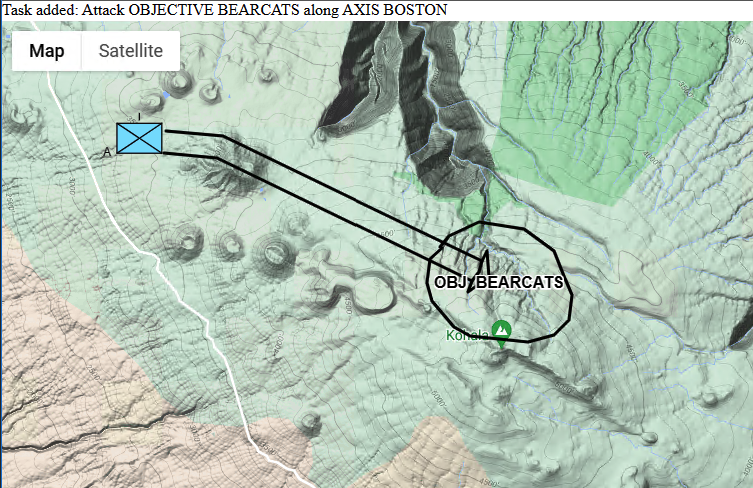

# Task event hadling sample

This sample adds handling of STP Tasks, extending the [gmaps](../gmaps) demonstration os Sketch-Thru-Plan sketch and speech creation of military plans.

For Prerequisites, Script references and Configuration, see the [gmaps sample README](../gmaps/README.md).

STP automatically identifies tasks from multiple symbols, for example identifying a potential attack when a Unit, an Objective, and a Main Attack symbol starting at the Unit and ending inside the Objective are placed on the map.

When one of the symbols of an identified task are modified or deleted, STP detects the changes and modifies or removes the affected task.



## Code walkthrough

See the [gmaps sample](../gmaps) for details on most of the code. Here just the changes introduced in this sample - task event handling - are described.

This sample adds simple task event handlers, that just display a short message to users when tasks are added, modified, or deleted. 

An actual application would provide users with user interface elements that would let users inspect, modify, delete, and confirm/approve tasks. 

### Event handling

As seen in previous samples, it is important to subscribe to the handlers of interest before connecting to STP. This information is used by the SDK to build the corresponding subscription parameters that tell STP which events/messages to send to this client app.

This samples adds the following subscriptions:

* onTaskAdded - invoked whenever a new task is created as a result of successful combination of multiple symbols
* onTaskModified - invoked whenever the properties of a task are modified
* onTaskDeleted - invoked whenever the a task is deleted/removed

 

```javascript
    // A new task has been recognized and added
    stpsdk.onTaskAdded = (poid: string, alternates: StpTask[], taskPoids: string[], isUndo: boolean) => {
        try {
            // Display some properties
            log("Task added: " + alternates[0].description, "Info");
        } catch (error) {
            log(error.message, "Warning");
        }
    };
    // The properties of a task were modified
    stpsdk.onTaskModified = (poid: string, alternates: StpTask[], taskPoids: string[], isUndo: boolean) => {
        try {
            // Display some properties
            log("Task modified: " + poid + " " + alternates[0].description, "Info");
        } catch (error) {
            log(error.message, "Warning");
        }
    };
    // A task was removed
    stpsdk.onTaskDeleted = (poid: string, isUndo: boolean) => {
        try {
            // Display some properties
            log("Task removed: " + poid, "Info");
        } catch (error) {
            log(error.message, "Warning");
        }
    };
```
### Types

* The `poid` parameter provides the unique identifier assigned by STP
* The `alternates` array provides the ranked task interpretation. It is common for a generic task to contain alternates for each of the possible doctrinal variations, for example and `Attack` usually includes alternates for `Attack to Fix`, `Secure`, `Destroy` and so on
* The `taskPoids` parameter is an array of the unique identifiers of all the Tactical Graphics associated with a task, for example objective, axis of advance and other elements STP detects are part of a task.

Each of the `alternates` is an StpTask object with the following properties:

| Property          | Description                                                                   |
| ---------------   | ----------------------------------------------------------------------------- |
| fsTYPE            | task                                 |
| poid              | STP unique identifier                                                         |
| parentCoa         | Unique id of the COA this task belongs to |
| creatorRole       | Role that created the task: S2, S3, S4, Eng, FSO |
| interval          | Task creation time interval |
| confidence        | Confidence score of the recognition (1.0 is 100%) |
| alt               | Rank of this task interpretation amongst the interpretation hypothesis| 
| description | Task description
| who | Unique id of the unit executing the task
| supported |   Unique id of the supported unit, if applicable
| tgs | Task's Tactical Graphics unique ids
| name | Task name, such as `AssaultObjectiveOnAxis`
| how | Task How enum
| what | Task What enum
| why | Task Why enum
| startTime | Start time slot
| endTime | End time slot
| speech | Associated speech, if applicable
| language | Language describing the task
| taskStatus | Automatic or manual creation status: `implicit` or `explicit`
| uiStatus | Confirmation status: `confirming` or `confirmed`
| prob | Task interpretation likelihood 

`What`, `How`, and `Why` are defined by enums:

```javascript
/**
 * Task What
 */
export enum TaskWhat {
  NotSpecified = "not_specified",
  AdvisePolice = "advise_police",
  Ambush = "ambush",
  AssignResponsibility = "assign_responsibility",
  Block = "block",
  BombAttack = "bomb_attack",
  Breach = "breach",
  Bypass = "bypass",
  Clear = "clear",
  CoerciveRecruiting = "coercive_recruiting",
  CollectCasualties = "collect_casualties",
  CollectCivilians = "collect_civilians",
  CollectPrisoners = "collect_prisoners",
  ConductAmbush = "conduct_ambush",
  ConductAviatonAmbush = "conduct_aviaton_ambush",
  ConductBilat = "conduct_bilat",
  ConductGroupEngagement = "conduct_group_engagement",
  ConductRaid = "conduct_raid",
  ConductTcpOperation = "conduct_tcp_operation",
  ConstituteReserve = "constitute_reserve",
  Convoy = "convoy",
  Defeat = "defeat",
  Delay = "delay",
  DeliverLeafletPsyop = "deliver_leaflet_psyop",
  Demonstrate = "demonstrate",
  Destroy = "destroy",
  Disrupt = "disrupt",
  DistributeFood = "distribute_food",
  Emplace = "emplace",
  EquipPolice = "equip_police",
  EscortConvoy = "escort_convoy",
  EvacuateCasualties = "evacuate_casualties",
  EvacuateCivilians = "evacuate_civilians",
  EvacuatePrisoners = "evacuate_prisoners",
  Fix = "fix",
  Follow = "follow",
  FollowAndAssume = "follow_and_assume",
  FollowAndSupport = "follow_and_support",
  Halt = "halt",
  HarrassmentFires = "harrassment_fires",
  HouseToHousePsyop = "house_to_house_psyop",
  IedAttack = "ied_attack",
  Limit = "limit",
  Looting = "looting",
  MaintainHide = "maintain_hide",
  MaintainOutpost = "maintain_outpost",
  Move = "move",
  Neutralize = "neutralize",
  Observe = "observe",
  Occupy = "occupy",
  Patrol = "patrol",
  Penetrate = "penetrate",
  PositionSniper = "position_sniper",
  PriorityOfFires = "priority_of_fires",
  ProvideMedicalServices = "provide_medical_services",
  ProvideService = "provide_service",
  Receive = "receive",
  Reconstruction = "reconstruction",
  RecruitPolice = "recruit_police",
  Refuel = "refuel",
  RegulateTraffic = "regulate_traffic",
  Reinforce = "reinforce",
  Release = "release",
  Resupply = "resupply",
  Retain = "retain",
  Rioting = "rioting",
  Secure = "secure",
  SeekRefuge = "seek_refuge",
  Seize = "seize",
  SniperAttack = "sniper_attack",
  Supply = "supply",
  SupplyMunitions = "supply_munitions",
  TrainPolice = "train_police",
  TransferMunitions = "transfer_munitions",
  TrashRemoval = "trash_removal",
  Turn = "turn",
  TvRadioPsyop = "tv_radio_psyop",
  WaterDelivery = "water_delivery",
  WillfulRecruiting = "willful_recruiting"
}

/**
 * Task How
 */
export enum TaskHow {
  NotSpecified = "not_specified",
  AirAssault = "air_assault",
  AirReconnaissance = "air_reconnaissance",
  AreaDefense = "area_defense",
  Assault = "assault",
  Attack = "attack",
  AttackInZone = "attack_in_zone",
  AttackByFire = "attack_by_fire",
  CerpFunding = "cerp_funding",
  Civilian = "civilian",
  Contracting = "contracting",
  CordonAndSearch = "cordon_and_search",
  Counterattack = "counterattack",
  CounterattackByFire = "counterattack_by_fire",
  Cover = "cover",
  Defend = "defend",
  DeliverServices = "deliver_services",
  Guard = "guard",
  InformationOperations = "information_operations",
  Insurgent = "insurgent",
  MobileDefense = "mobile_defense",
  MovingScreen = "moving_screen",
  NgoOperation = "ngo_operation",
  PassageOfLines = "passage_of_lines",
  Screen = "screen",
  SearchAndAttack = "search_and_attack",
  Security = "security",
  SecurityForceAssistance = "security_force_assistance",
  SupportByFire = "support_by_fire",
  Withdrawal = "withdrawal"
}

/**
 * Task Why
 */
export enum TaskWhy {
  Unknown = "unknown",
  Allow = "allow",
  Cause = "cause",
  Create = "create",
  Deceive = "deceive",
  Deny = "deny",
  Divert = "divert",
  Enable = "enable",
  Envelop = "envelop",
  Influence = "influence",
  Open = "open",
  Prevent = "prevent",
  Protect = "protect",
  Support = "support",
  Surprise = "surprise"
}

```

### Communicating task edits to STP

Task edits performed via a client interface, for example in a Task Editor, or a Sync Matrix editor, need to be communicated to STP, so that the internal state is consistent, and  actions performed by a client can be propagated to other clients that may be connected to the same collaboration session.

The following SDK methods are available to communicate client task edits:

```javascript
  /**
   * Request that a task be added by STP. The actual addition should only happen when STP responds with TaskAdded
   * @param task Task to add
   */
  addTask(task: StpType.StpTask);

  /**
   * Request that a task be updated by STP. The actual update should only happen when STP responds with TaskModified
   * @param poid Unique identifier of the task to update
   * @param alternates Alternates of the task to update - normally only one of the alternates will have been modified 
   */
  updateTask(poid: string, alternates: StpType.StpTask[]);

  /**
   * Request a task deletion from STP. The actual removal should only happen when STP responds with TaskDeleted
   * @param poid Unique identifier of the task to delete
   */
  deleteTask(poid: string);

  /**
   * Pick an alternate as the confirmed task. The STP runtime responds with a task update notification
   * in which uiStatus is set to 'confirmed'
   * @param poid Unique identifier of the task for which an alternate is being confirmed
   * @param nBestIndex Index indicating which of the current alternates is selected for confirmation
   */
  confirmTask(poid: string, nBestIndex: number);
```
Approving/confirming a task is similar to selecting a symbol alternate. A specific interpretation is chosen for a task, e.g. `Attack Objective to Fix`. Other alternates (e.g. `to Secure`, `to Destroy`) are removed.

Upon processing these commands, STP replies with the corresponding events: `onTaskAdded`, `onTaskModified` and `onTaskDeleted` respectively.
`onTaskModified` is issued as a response to `confirmTask`, with the `uiStatus` set to 
`confirmed`.

It is advisable for clients to update the interface just in response to the events reflecting STP's change of state, so that all clients can remain consistent with the Engine's state.
In other words, rather than marking a task as confirmed as the user for example selects a checkbox, it is recommended that the task be marked only in response to STP's `onTaskModified` event indicating a `confirmed` `uiStatus`.

